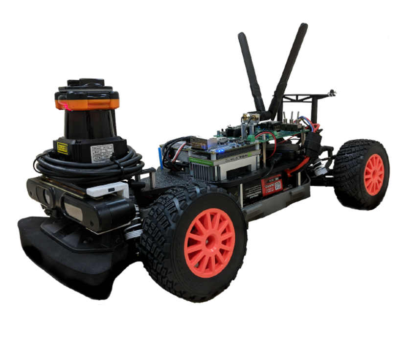

# Self-Learning Car: Simulation, Control, and Sensor Fusion

An autonomous-driving course project that connects three layers of robotics
work: learning a driving policy in simulation, testing classical control, and
bringing sensing and control onto a 1/10-scale F1TENTH vehicle.

This was a team project for **UCLA CS269: Human-Centered AI, Spring 2022**, by
**Yunbo Wang and Ouyang Boya**. The original report describes a genetic
algorithm that evolves a small neural controller from simulated range-sensor
inputs. The additional videos document PID control, CARLA LiDAR/camera
visualization, and physical vehicle assembly testing.

**[Read the original UCLA project report](https://ucladeepvision.github.io/CS269-projects-2022spring/2022/04/24/team20-.Self-Learning-Car.html)**
· **[Watch the three video demos](demos/README.md)**

  

## Project question

Can a compact neural policy learn steering and throttle directly from simulated
range measurements, and what changes when that control stack moves from a
simulator to a physical vehicle?

The project used a ROS-based F1TENTH simulator on Ubuntu 18.04. Five
front-facing distance sensors covered approximately 90 degrees with a maximum
range of 10 simulator units. Their readings fed a fully connected neural
network:

~~~text
5 range measurements
        |
        v
Input layer: 5 neurons
        |
        v
Hidden layers: 4 -> 3 neurons
        |
        v
Outputs: steering + engine force
~~~

Instead of training the weights with gradient descent, the project used a
genetic algorithm:

1. Spawn a population of randomly initialized cars.
2. Evaluate each controller by how well it navigates the track.
3. Select the strongest controllers.
4. Recombine and mutate their weights to create the next generation.
5. Repeat until the simulated policy can complete the course.

## System view

| Track | Input | Method | Output demonstrated |
|---|---|---|---|
| Learned driving policy | Five simulated range readings | Genetic algorithm evolving a 5-4-3-2 feed-forward network | Steering and engine commands in the F1TENTH simulator |
| Classical control | Simulated vehicle state and track geometry | PID feedback control | Stable path-following behavior |
| Sensor integration | CARLA camera and LiDAR streams | Multi-sensor visualization and synchronization | Overhead, driver-view, and point-cloud displays |
| Hardware bring-up | Physical 1/10-scale platform, 2D LiDAR, onboard compute, and controller | Assembly and bench integration testing | Bench-level assembly and actuation demonstration |

These are complementary demonstrations. The CARLA and PID videos are supporting
engineering experiments; they are not presented as results of the genetic
algorithm described in the course report.

## Video demos

The six-second GIF previews play automatically. Click a preview to open the complete GitHub-hosted video.

### PID control in the F1TENTH simulator

The vehicle follows a narrow simulated course while the visualization exposes
the vehicle pose and surrounding range information.

### CARLA LiDAR and camera visualization

The CARLA recording shows combined overhead and driver-facing camera views
alongside two LiDAR point-cloud displays.

### Physical F1TENTH assembly test

This bench test shows the assembled platform, including the chassis, steering
and drive hardware, onboard electronics, and 2D LiDAR.

For duration, resolution, codec, and original filename details, see the
**[video gallery](demos/README.md)**.

## Result and engineering lesson

The evolved controller worked well in simulation: after repeated
selection/recombination/mutation cycles, the simulated car could navigate the
course. Transferring the result to the physical platform was less successful.
The course report identifies a timing mismatch between the controller and the
2D LiDAR as the primary failure mode, causing delayed observations and crashes.

That gap is the central engineering lesson of the project:

- simulation validates an algorithm under controlled timing;
- hardware introduces sensor latency, asynchronous clocks, actuation delay, and
  safety constraints;
- a successful policy therefore depends on systems integration as much as the
  learning algorithm;
- PID control provides a useful classical baseline against which a learned
  controller can be compared.

## What this project demonstrates

- Understanding of evolutionary optimization for neural-network weights.
- Ability to trace a control policy from sensor input to steering and throttle.
- Experience with ROS-based F1TENTH simulation and physical platform bring-up.
- Work with 2D LiDAR, camera streams, CARLA, and multi-sensor visualization.
- Practical awareness of the simulation-to-real gap and sensor/control timing.
- Clear separation between successful simulation results and incomplete
  hardware transfer.

## Repository map

| Path | Purpose |
|---|---|
| [demos/](demos/README.md) | Three videos, playback links, and media metadata |
| [assets/images/team20/](assets/images/team20/) | Original Team 20 figures and generated video preview images |
| [_posts/2022-04-24-team20-.Self-Learning-Car.md](_posts/2022-04-24-team20-.Self-Learning-Car.md) | Local source for the original course report |
| [docs/course-site-readme.md](docs/course-site-readme.md) | Original instructions for the UCLA course website |
| [_posts/](_posts/) | Other CS269 team reports retained from the course-site fork |

## Scope and provenance

This repository is a portfolio-oriented fork of the UCLA CS269 Spring 2022
project website. The top-level README highlights Team 20; reports and assets
from other teams remain the work of their original authors.

The original report is jointly authored by Yunbo Wang and Ouyang Boya. This
repository is a documentation and demonstration archive: it does not include
the full ROS workspace, simulator source, trained controller weights, or a
turnkey reproduction environment.

## Team

**Yunbo Wang · Ouyang Boya**
UCLA CS269: Human-Centered AI, Spring 2022
