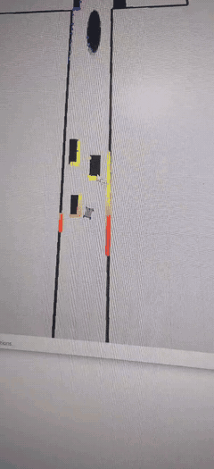
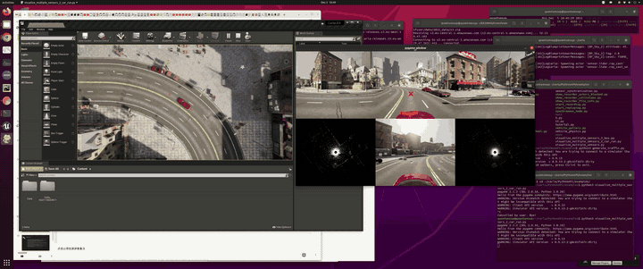
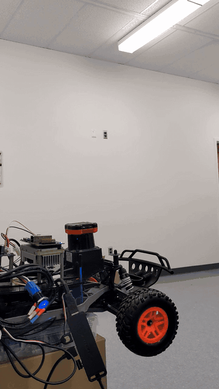

# Video demos

These recordings document three parts of the autonomous-driving workflow:
classical control in simulation, CARLA sensor visualization, and physical
F1TENTH platform bring-up.

Each GIF preview plays automatically. The PID preview is eight seconds at 1.5×
speed; the other two are six-second loops. Click it or the direct link below to
open or download the original GitHub-hosted recording.

## 1. F1TENTH PID control

**[Open/download full video](f1tenth-pid-control.mp4?raw=1)**

- Duration: 21.5 seconds
- Preview: 8 seconds at 1.5× playback speed
- Resolution: 592 × 1296
- Video/audio: H.264 + AAC
- Demonstrates: PID-based path following in the F1TENTH simulator
- Original local filename: F1_10_PID.mp4

## 2. CARLA LiDAR and camera visualization

**[Open/download full video](carla-lidar-fusion.webm?raw=1)**

- Duration: 30.0 seconds
- Resolution: 3440 × 1440
- Video: VP8/WebM
- Demonstrates: CARLA overhead/driver camera views and dual LiDAR point-cloud
  displays running together
- Original local filename: fusion_with_display.webm

## 3. Physical F1TENTH assembly test

**[Open/download full video](f1tenth-car-assembly.mp4?raw=1)**

- Duration: 17.7 seconds
- Resolution: 1280 × 720
- Video/audio: H.264 + AAC
- Demonstrates: assembled chassis, onboard electronics, drive/steering
  actuation, and 2D LiDAR integration
- Original local filename: car_assembel_test.mp4

## Notes

- The recordings retain their original codecs and visual content; only the
  repository filenames were normalized.
- Animated previews are short GIF loops extracted from the videos.
- The CARLA recording is a desktop capture and is best viewed at full
  resolution.
- These files are demonstrations rather than a quantitative benchmark.

[Back to the project overview](../README.md)
